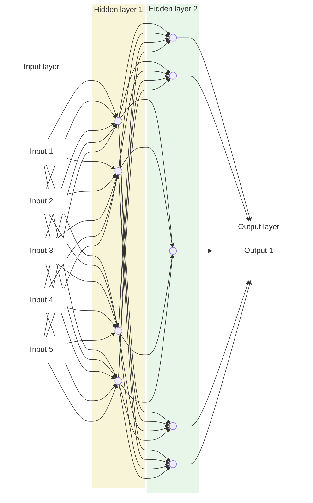

```mermaid
flowchart LR;
    I1-->H1
    I1-->H2
    I1-->H3
    I1-->H4
    I2-->H1
    I2-->H2
    I2-->H3
    I2-->H4
    I3-->H1
    I3-->H2
    I3-->H3
    I3-->H4
    I4-->H1
    I4-->H2
    I4-->H3
    I4-->H4
    I5-->H1
    I5-->H2
    I5-->H3
    I5-->H4

    H1-->h1
    H1-->h2
    H1-->h3
    H1-->h4
    H1-->h5
    H2-->h1
    H2-->h2
    H2-->h3
    H2-->h4
    H2-->h5
    H3-->h1
    H3-->h2
    H3-->h3
    H3-->h4
    H3-->h5
    H4-->h1
    H4-->h2
    H4-->h3
    H4-->h4
    H4-->h5
    h1-->Output
    h2-->Output
    h3-->Output
    h4-->Output
    h5-->Output

subgraph Input[Input layer]
  direction LR
  style Input fill:#FFFFFF,stroke:#333,stroke-width:0px;
  I1[Input 1]
  I2[Input 2]
  I3[Input 3]
  I4[Input 4]
  I5[Input 5]
  style I1 fill:#FFFFFF,stroke:#333,stroke-width:0px;
  style I2 fill:#FFFFFF,stroke:#333,stroke-width:0px;
  style I3 fill:#FFFFFF,stroke:#333,stroke-width:0px;
  style I4 fill:#FFFFFF,stroke:#333,stroke-width:0px;
  style I5 fill:#FFFFFF,stroke:#333,stroke-width:0px; 
end

subgraph Hidden1[Hidden layer 1]
  direction LR
  style Hidden1 fill:#F7F4D7,stroke:#333,stroke-width:0px;
  H1(( ))
  H2(( ))
  H3(( ))
  H4(( ))
end

subgraph Hidden2[Hidden layer 2]
  direction LR
  style Hidden2 fill:#E8F5E9,stroke:#333,stroke-width:0px;
  h1(( ))
  h2(( ))
  h3(( ))
  h4(( ))
  h5(( ))
end

subgraph Output[Output layer]
  direction LR
  style Output fill:#FFFFFF,stroke:#333,stroke-width:0px;
  O1[Output 1]
  style O1 fill:#FFFFFF,stroke:#333,stroke-width:0px;
end
```